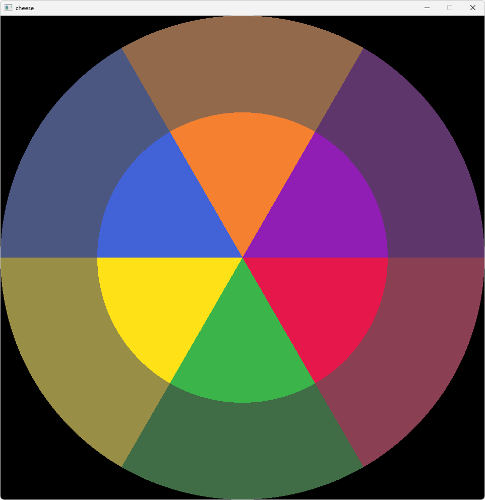

# cheese-puzzle

## how
download [release](https://github.com/ozenge/cheese-puzzle/releases/download/v1/cheese-puzzle.zip), extract, and run with run.bat
**left click and hold**: front and back turns
**right click and hold**: side turns

## what
[BQN](https://mlochbaum.github.io/BQN/) with [raylib](https://www.raylib.com).dll

## solved state

